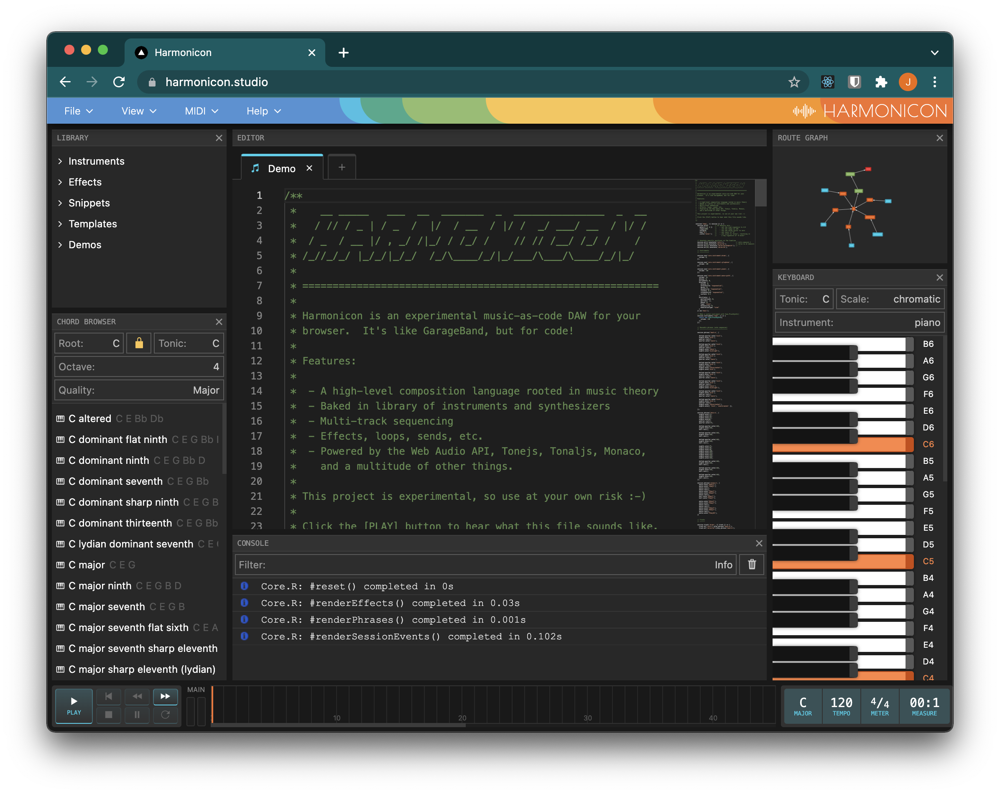

# Harmonicon

This repository contains the source code for [harmonicon.studio](https://harmonicon.studio), an experimental music-as-code DAW for browsers.




# Development

To run Harmonicon locally, clone this repository and run:

```
yarn install
yarn dev
```

The UI is served on http://localhost:3000.
