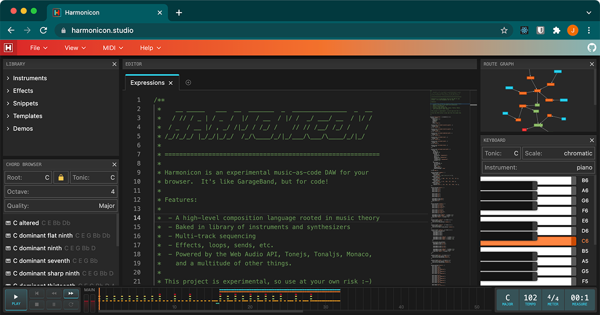

# Harmonicon

Source code for [harmonicon.studio](https://harmonicon.studio), an experimental music-as-code DAW for browsers.




## Status

This project is simply scratching a personal itch, and at this time **I have no plans to support it as a traditional open source maintainer**.

If you find this concept to be a worthwhile pursuit, your best course of action is to fork and start hacking.  Maybe you'll make something cooler!  The future of audio engineering is in the browser, man, I promise you.  Godspeed and good luck!


## Development

To run Harmonicon locally, clone this repository and run:

```
yarn install
yarn dev
```

The UI is served on http://localhost:3000.
